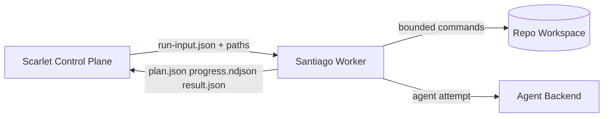

# System Context and Boundaries

## Purpose

Define the operational boundary between Scarlet (control plane) and Santiago (execution worker) so integration is stable even as loop strategy evolves.

## Actors

- Scarlet orchestrator service.
- Santiago CLI worker process.
- Git repository workspace (local checkout prepared by Scarlet).
- Agent runtime backend (initially OpenCode-oriented through `ralph_fresh`).

## Ownership Boundary

### Scarlet owns

- PRD discovery and run eligibility.
- Durable orchestration state and run lifecycle.
- Branch lifecycle, push, and pull request actions.
- Secret handling policy and system operations.

### Santiago owns

- PRD decomposition into deterministic stories and tasks.
- Story execution loops (`plan -> execute -> verify -> critique`).
- Per-story completion, failure, and blocked signaling.
- Structured artifacts (`plan.json`, `progress.ndjson`, `result.json`).

## Integration Contract

Scarlet invokes Santiago as a local CLI worker:

```bash
santiago plan --input <run-input.json> --out-dir <run-artifacts-dir>
santiago execute --input <run-input.json> --plan <plan.json> --out-dir <run-artifacts-dir>
```

Key invariants:

- Contract version is explicit and validated before execution.
- Santiago never mutates Scarlet global orchestration state.
- Santiago writes terminal `result.json` on all terminal exits.
- Exit codes communicate retryability (`0`, `10`, `20`, `30`).

## Trust and Safety Zones

- Treat agent output as untrusted input.
- Restrict subprocess writes to repository path and artifact output path.
- Enforce explicit command policy with bounded timeout.

## Context Diagram



## Non-Goals in This Boundary

- Repository polling and queue management.
- Branch creation, push, and pull request publication.
- Deployment concerns for Scarlet services.
